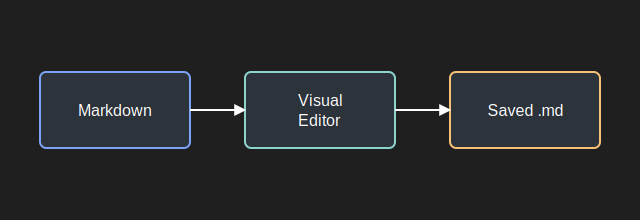

# Markdown Spreadsheet Sample

Use the command `Markdown Spreadsheet: Open Table Editor` while this file is active.

This paragraph should stay as normal Markdown text. It can be edited in the document block without converting the whole file into a table.

| Item | Owner | Status | Notes |
| --- | --- | --- | --- |
| VS Code prototype | Codex | In progress | Open a Webview grid |
| Markdown round trip | Codex | Ready | Save edits back to this file |
| Excel-like controls | User | Next | Add richer grid actions |

Regular Markdown content below the first table should remain editable too.

| Month | Income | Expense |
| --- | --- | --- |
| April | 5000 | 3200 |
| May | 5400 | 3300 |

The second table is also opened as a grid, while this final paragraph remains plain Markdown.
